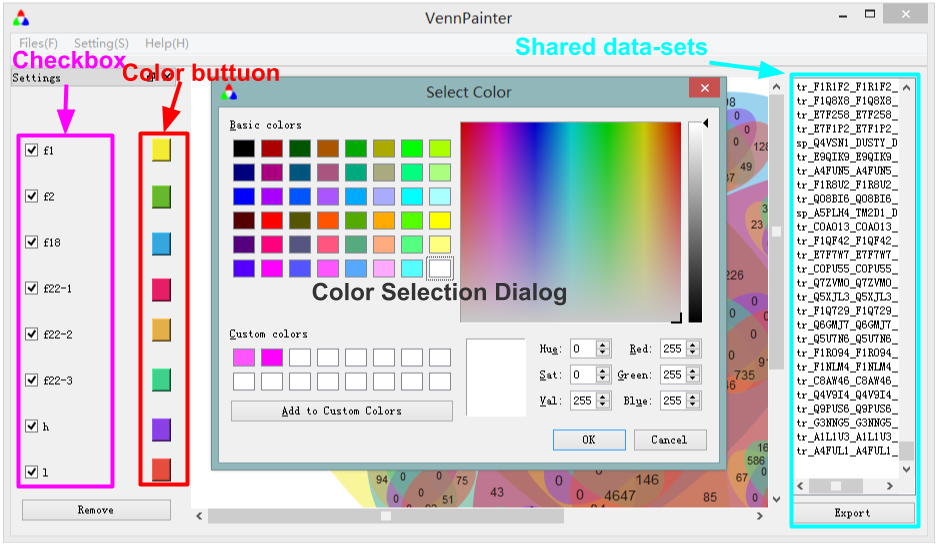
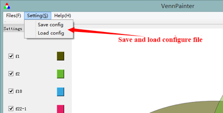
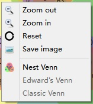
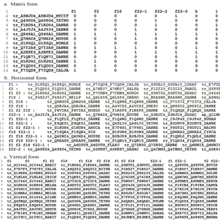

<<<<<<< HEAD
VennPainter
===========
hello everyone!
VennPainter was developed in Qt 4.8.5
=======
#VennPainter User Manual
##1 Introduction
###1.1 Purpose
This manual will introduce How to use VennPainter in detail.
###1.2 Background
Venn Diagram is diagram with a few closed curve to indicate the relationships among datasets, including intersection, sum, complement. In comparative genomics, they depict unique and shared sets of genes or gene families. Many programs can generate Venn diagrams, yet these come with many inconveniences, such as inefficiency, limited input, and memory-consumption. To provide a more comprehensive tool for genome research, we developed the program VennPainter using a C++ in Qt framework.
##2 Application
###2.1 Function
The main function of this software is to draw venn diagram based on the various datasets (including gene names, protein names, etc.), and export shared datasets. The software can run on windows, Linux and Mac OS.
####2.1.1. Paint module
Paint module draws Venn diagrams according to input dataset. Venn diagrams are automatically generated after loading the data. There are some operations to modify Venn diagram. Eight checkboxes and nine buttons, including eight ‘color-choice’ and a ‘remove’ buttons make user easier to modify venn diagram.

Users can use ‘color-choice’ to change set’s color, and use checkboxes to change the number of sets.
 
 

Color Selection Dialog

Users can use save and load configure file through ‘Setting->Load config’ and ‘Setting->Save config’. The configure file only contains the color patterns ,at present.
 

Save and load configure file

This software allows you zoom the venn diagram through "right click" menu or ‘Ctrl+ Middle button’. To export image, user can also use "right click" menu or through ‘Files->Save image’
 

"right click" menu
####2.1.2. Data Output Module
Using ‘Files->Save as’ to export shared datasets. There are three formats for shared datasets：

Horizontal format(.hf): each row is a shared dataset.

Vertical format (.vf): each colum is a shared dataset.

Matrix format(.mf): the maxtrix represents the relationship between datasets and elements. 
 

Output Data Format
##3 Run-time Environment
###3.1 Hardware
VennPainter was developed using Qt 4.8.5 under its LGPL v2.1 license. We have tested this software on Win xp,Win 7,Win 8,Linux Mint 13,Mac OS 10.8.5.

Minimum requirement： PC (PIII866)，512M memory，20G Hard disk
###3.2 System
Operating system：Windows xp or higher，Linux, Mac OS 10.8.5 or higher.
##4 Input Data Format
VennPainter requires input data that consist of an individual text file for each dataset. Further, space, carriage return or horizontal tab key must separate every element in the dataset.

>>>>>>> dcb1621b7beaef313acfc739c617b89681f13420
